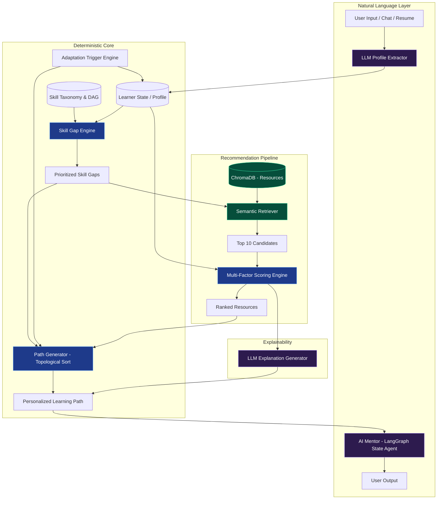

# PathFinder — AI/ML Architecture & Recommendation Pipeline

---

## 1. Core Principles: The Hybrid AI Approach

PathFinder relies on a **Hybrid Recommendation Architecture**. To prevent hallucinated paths and black-box recommendations, the system strictly separates **stochastic components** (LLMs for NLU/NLG) from **deterministic components** (algorithms for sequencing and scoring).

*   **LLMs (OpenAI GPT-4o-mini / Gemini 1.5 Flash):** Used only for Natural Language Understanding (extracting profiles from chat/resumes), Natural Language Generation (explaining recommendations), and the conversational AI Mentor.
*   **Embeddings (text-embedding-3-small / sentence-transformers):** Used for semantic retrieval of learning resources.
*   **Deterministic Algorithms (Python logic):** Used for skill-gap detection, multi-factor recommendation scoring, prerequisite path generation (DAG topological sort), and progress-based adaptation.

---

## 2. Data Representation & Ontology

### 2.1 Skill Representation
Skills are represented in a structured taxonomy. Each skill has an ID, display name, and a numeric proficiency level.
*   `Level 0`: None
*   `Level 1`: Beginner (Familiar with concepts)
*   `Level 2`: Intermediate (Can apply practically)
*   `Level 3`: Advanced (Can architect/optimize)

**Example Skill:**
```json
{
  "skill_id": "python_pandas",
  "name": "Pandas Data Manipulation",
  "aliases": ["pandas", "dataframes"],
  "domain": "Data Science"
}
```

### 2.2 Prerequisite Modelling (Skill Graph)
Prerequisites are modeled as a Directed Acyclic Graph (DAG) defined at the skill level (not the course level). 
*   `Node`: A specific skill.
*   `Edge`: Dependency (`A -> B` means A is required before B).

**Simple Prerequisite Graph:**
```
Basic Math --> Probability --> Statistics ──────────────┐
                                                        v
Python Basics --> Python Data Structures --> Pandas --> Machine Learning Basics
```

### 2.3 Course/Resource Representation
Resources are structured with metadata for deterministic filtering and semantic text for vector search.
```json
{
  "resource_id": "res_101",
  "title": "Data Analysis with Pandas",
  "description": "Learn to manipulate DataFrames, handle missing data, and group aggregations.",
  "skills_covered": ["python_pandas"],
  "difficulty_level": 2, // Matches skill level (Intermediate)
  "duration_hours": 4.5,
  "format_type": "video", // video, article, project, quiz
  "quality_score": 4.8    // Base quality/rating
}
```

---

## 3. Learner Intelligence

### 3.1 Skill Extraction from Natural-Language Goals
**Mechanism:** LangChain `with_structured_output` using Pydantic Models.
**Input:** Chat history + User Goal ("I know some python but want to become an ML engineer")
**Prompting Strategy:** System prompt directs the LLM to map inputs to the `LearnerProfile` Pydantic class. LangChain automatically enforces the schema and handles validation parsing for `target_role`, `current_skills`, `time_budget`, and `experience_level`.

### 3.2 Learner Profiling (Continuous State)
The learner profile is a dynamic state machine that updates as the learner progresses.
*   **Static/Stated Data:** Goal, initial skills, time budget, preferred format.
*   **Dynamic/Observed Data:** 
    *   `mastery_map`: Real-time map of `{skill_id: level}` based on assessments.
    *   `format_affinity`: Weighted preference (e.g., clicks "skip" on articles, completes videos).
    *   `difficulty_tolerance`: Tracks if they frequently click "Struggling".
    *   `reward_history`: `{resource_id: float}` capturing implicit/explicit feedback.

### 3.3 Skill-Gap Detection
**Mechanism:** Deterministic Array Comparison
1.  Map the `target_role` (e.g., "ML Engineer") to a curated list of required skills and required levels.
2.  Compare against the learner's `mastery_map`.
3.  `Gap = Required Level - Current Level`. Filter where `Gap > 0`.
4.  **Prioritization:** Priority is calculated as `(Topological Depth * 0.6) + (Gap Severity * 0.4)`. Prerequisite skills deep in the graph are higher priority.

---

## 4. Recommendation Engine (Hybrid Search + Algorithmic)

The recommendation engine answers: *"For this specific skill gap, what is the best resource for THIS learner?"*

### 4.1 Embedding Strategy
*   **Model:** `text-embedding-3-small` (or local `all-MiniLM-L6-v2`).
*   **Document Formulation:** We embed a concatenated string of the resource: `"{title}. {description}. Covers skills: {skills_covered}"`.
*   **Storage:** ChromaDB collection with associated metadata (`difficulty`, `format_type`, `duration_hours`).

### 4.2 Semantic Retrieval (Stage 1)
For a target skill gap (e.g., "Probability"):
1.  **Query:** Embed the skill name and description.
2.  **Filter:** Apply ChromaDB `where` filters based on hard constraints (e.g., `difficulty_level <= learner_tolerance + 1`).
3.  **Retrieve:** Fetch the top 10 most semantically similar resources.

### 4.3 Recommendation Scoring & Course Ranking (Stage 2)
For the 10 retrieved candidates, calculate a multi-factor personalization score:

```python
Final_Score = (
    w1 * Semantic_Similarity_Score (from ChromaDB, normalized) +
    w2 * Difficulty_Fit(Resource Level vs Learner Level) +
    w3 * Time_Fit(Resource Duration vs Weekly Budget) +
    w4 * Format_Affinity(Resource Format vs Learner Preference) +
    w5 * Historical_Reward(Learner's past interaction with this provider/format) +
    w6 * Prerequisite_Satisfaction(Does learner meet this specific course's prereqs?)
)
# Default MVP Weights: w1=0.30, w2=0.20, w3=0.15, w4=0.10, w5=0.10, w6=0.15
```
**Ranking:** The resources are sorted by `Final_Score`. Top 1 is selected for the learning path; Top 2-3 are stored as "Alternatives".

---

## 5. Learning-Path Generation

### 5.1 Learning-Path Sequencing
**Mechanism:** Deterministic Topological Sort on DAG.
1.  Create a subgraph of the Prerequisite DAG containing ONLY the learner's skill gaps.
2.  Run Kahn's Algorithm (Topological Sort) to generate a linear sequence of skills.
3.  For each skill in sequence, fetch the #1 Ranked Resource from the Recommendation Engine.
4.  Accumulate `duration_hours` across resources to assign them into discrete "Weeks" based on the learner's `time_budget`.

### 5.2 Milestone & Project Recommendation
*   **Milestones:** Inserted programmatically when a cluster of related skills (e.g., all "Data Analysis" nodes) is completed.
*   **Project Recommendation:** At a milestone, the recommendation engine queries ChromaDB specifically for `format_type="project"`, filtering for projects that cover >= 70% of the newly acquired skills.

### 5.3 Assessment Recommendation (RAG)
After completing a module, the system uses a **RetrievalQA (RAG) Chain**. LangChain queries ChromaDB for the transcript/description of the specific module just completed and generates a highly targeted 3-question MCQ quiz based *strictly* on that retrieved content to eliminate hallucinations.

---

## 6. Adaptation & Feedback

### 6.1 Progress-Based Adaptation
The path is a living entity, recalculated based on triggers:
*   **"Struggling" Button:** System searches the Prerequisite DAG for the direct parent of the current skill, retrieves a `format="refresher"` resource, and injects it immediately before the current module.
*   **"Too Easy / Skip":** System bumps the learner's `mastery_map` for that skill to 'Target Level', removes the module, and recalculates timeline.
*   **Assessment Failure (<50%):** Triggers the same adaptation as "Struggling".
*   **Assessment Success (>85%):** Bumps `mastery_map`. Checks if subsequent modules are now redundant.

### 6.2 Feedback Incorporation (Implicit/Explicit)
*   **Implicit:** Completion speed. If a learner consistently finishes 4hr video modules in 2hrs, their `format_affinity` for video increases, and their effective `time_budget` velocity multiplier increases.
*   **Explicit:** Thumbs up/down on resources updates the `Historical_Reward` matrix (collaborative filtering placeholder for MVP).

---

## 7. Explainability & Mentorship

### 7.1 Explanation Generation (XAI)
Every recommendation requires an explanation. We do NOT ask the LLM to invent an explanation. We feed the actual `Final_Score` factors to the LLM or a deterministic template.
*   *Template Approach:* "This fits your goal because it covers [Skill]. It matches your [Difficulty] level and fits your [X hours] budget."
*   *LLM Approach:* `Prompt: Explain this recommendation to the user using these exact scoring factors: {scoring_dict}`.

### 7.2 AI Mentor (LangGraph Stateful Agent)
The Mentor is built using **LangGraph** to maintain complex conversational states. It has access to specific tools via LangChain.
*   **Context Window:** Learner Profile, current `mastery_map`, current Path, current active module.
*   **Tools (Functions):** `get_skill_gap()`, `explain_score(module_id)`, `trigger_recalculation()`, `insert_refresher(skill_id)`.
*   **Workflow:** User asks "Why am I learning Math?". Agent uses `get_skill_gap` to see Math is a prereq for ML, and explains it contextually.

### 7.3 Hallucination Prevention
1.  **Strict Separation of Concerns:** LLM *never* generates the curriculum or course links. It only extracts data and formats text.
2.  **RAG Constraints:** Semantic retrieval enforces metadata bounds (duration, difficulty). The LLM cannot recommend a course that doesn't exist in ChromaDB.
3.  **Agent Tool Boundaries:** The AI Mentor cannot modify the path arbitrarily; it can only invoke the deterministic `trigger_recalculation()` engine.

---

## 8. AI Architecture Diagram (Mermaid)



---

## 9. Component I/O & Model Choices

| Component | Model/Tech | Input | Output |
| :--- | :--- | :--- | :--- |
| **Profile Extractor** | GPT-4o-mini (JSON Mode) | `string` (chat history) | `JSON` (LearnerProfile) |
| **Skill-Gap Engine** | Python Logic | `TargetRole`, `Learner_Mastery_Map` | `List[GapItem]` (sorted) |
| **Embeddings** | text-embedding-3-small | `string` (resource text) | `List[float]` (1536d vector) |
| **Retriever** | ChromaDB | `string` (skill name), `metadata_filters` | `List[Resource]` (Top K=10) |
| **Scorer** | Python Math | `List[Resource]`, `LearnerState` | `List[RankedResource]` |
| **Path Generator** | Python (Kahn's Algo) | `List[GapItem]`, `List[RankedResource]` | `LearningPath` (timeline) |
| **Explainer** | GPT-4o-mini (Prompt) | `RankedResource.scores` | `string` (Explanation text) |
| **AI Mentor** | GPT-4o-mini (Tools/ReAct) | `string` (User msg), `LearnerState` | `string` (Reply) or `ToolCall` |

---

## 10. Algorithms / Pseudocode

### Multi-Factor Recommendation Scoring
```python
def score_candidate(candidate_resource, learner_state, gap_item):
    # 1. Semantic Similarity (normalized 0 to 1 from ChromaDB distance)
    semantic_score = normalize(candidate_resource.distance)
    
    # 2. Difficulty Fit
    diff_delta = abs(candidate_resource.difficulty - learner_state.current_level)
    diff_score = 1.0 if diff_delta == 0 else (0.7 if diff_delta == 1 else 0.2)
    
    # 3. Time Fit
    if candidate_resource.duration <= learner_state.time_budget:
        time_score = 1.0
    else:
        time_score = learner_state.time_budget / candidate_resource.duration
        
    # 4. Format Affinity
    format_score = 1.0 if candidate_resource.format == learner_state.preferred_format else 0.6
    
    # 5. Calculate Final Weighted Score
    final_score = (
        (0.35 * semantic_score) +
        (0.25 * diff_score) +
        (0.20 * time_score) +
        (0.20 * format_score)
    )
    return final_score
```

### Adaptation Trigger (Struggling)
```python
def handle_struggling(module_id, learner_state, dag):
    current_skill = db.get_module(module_id).skill_id
    
    # Find immediate prerequisite in DAG
    prereq_skills = dag.get_parents(current_skill)
    
    if not prereq_skills:
        return prompt_mentor("No prereqs found, ask user what specifically is hard.")
        
    target_prereq = prereq_skills[0]
    
    # Retrieve a quick refresher resource
    candidates = retriever.search(target_prereq, filters={"format": "article/short_video"})
    best_refresher = scorer.rank(candidates, learner_state)[0]
    
    # Modify Path
    path.insert_before(module_id, best_refresher)
    path.shift_timeline()
    
    return "Recalculated: Inserted refresher for " + target_prereq
```

---

## 11. Evaluation Metrics

### AI/ML Component Evaluation (Offline)
*   **Extraction Accuracy:** % of correct JSON profiles parsed from test chat transcripts (Precision/Recall on entities).
*   **Retrieval (NDCG@10):** Normalized Discounted Cumulative Gain of ChromaDB search against human-annotated relevant courses.
*   **DAG Validity Check:** 100% pass rate on algorithmic tests verifying no topological sorting cycles or dependency violations.
*   **Hallucination Rate (Mentor):** % of mentor responses referencing courses not in the database (Target: 0%).

### Recommendation System Evaluation (Online / Product Metrics)
*   **Acceptance Rate:** % of times a learner clicks "Start" on the #1 Recommended Next Best Action.
*   **Adaptation Success:** Completion rate of the *subsequent* module after a "Refresher" is inserted via the adaptation engine.
*   **Time-to-Milestone:** Variance between AI-estimated timeline and actual timeline.

---

## 12. MVP vs. Future AI Implementation

| Component | Hackathon MVP Implementation | Future/Advanced Implementation |
| :--- | :--- | :--- |
| **Resource DB** | 50-100 manually curated JSON resources. | Web-scraping pipelines ingesting Coursera/Udemy APIs. |
| **Prerequisite Graph** | Hardcoded JSON DAG for 3-4 specific roles. | Automated LLM-based DAG extraction from syllabus data. |
| **Embeddings** | `text-embedding-3-small` via API. | Fine-tuned sentence-transformers on educational domain data. |
| **Scoring Weights** | Fixed heuristic weights (e.g., 30% difficulty, 20% time). | Contextual Bandits / Reinforcement Learning to adjust weights dynamically per user. |
| **Assessments** | LLM dynamically generates 3 MCQ questions on the fly. | Adaptive Item Response Theory (IRT) with a validated question bank. |
| **Feedback Loop** | Updates simple preference multipliers. | Trains a downstream collaborative filtering model (Matrix Factorization). |
