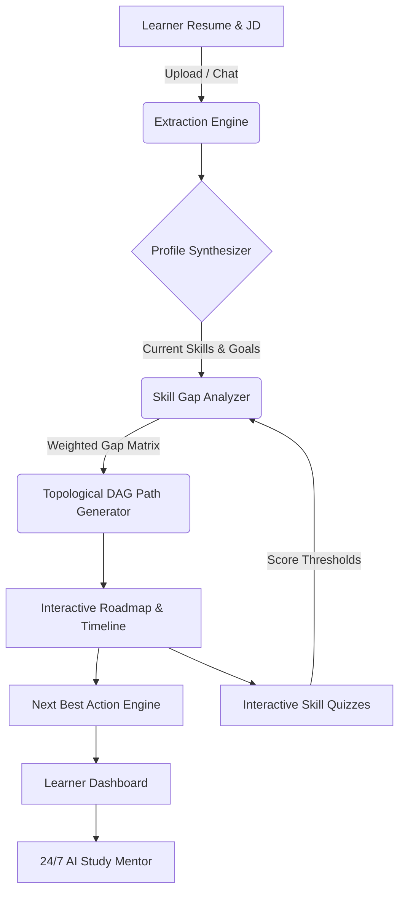

<div align="center">

# 🚀 PathFinder AI
### *Autonomous, Adaptive Career Navigation & Personalized Curriculum Generation Engine*

[](https://reactjs.org/)
[](https://fastapi.tiangolo.com/)
[](https://tailwindcss.com/)
[](https://opensource.org/licenses/MIT)

<p align="center">
  <b>Transform resumes and dream job descriptions into adaptive, DAG-based learning roadmaps backed by live educational resources and skill-specific verification quizzes.</b>
</p>

[Key Features](#-key-features) • [Architecture](#-architecture) • [Supported Domains](#-supported-domains--career-roles) • [Quick Start](#-quick-start) • [API Documentation](#-api-endpoints) • [Project Structure](#-project-structure)

</div>

---

## 📖 Overview

**PathFinder** is an intelligent career navigation platform designed to bridge the gap between a learner's current capabilities and their target dream role. By extracting profile data from uploaded resumes and target job descriptions, PathFinder computes exact skill gaps across multiple difficulty tiers, organizes weekly learning milestones via a **Directed Acyclic Graph (DAG)**, and continuously recalibrates your curriculum based on interactive skill quiz evaluations.

---

## ✨ Key Features

- 🎯 **Target Dream Roles across 6 Domains**: Supports 24 specialized industry roles in Technology, Business, Finance, Creative, Marketing, and Healthcare.
- 📊 **Dynamic Skill Gap Telemetry**: Computes granular gap sizes ($G = \text{Target Level} - \text{Current Level}$) with priority-weighted indexing.
- 🗺️ **Subway Map Interactive Roadmap**: Visualizes weekly learning tracks with prerequisite dependency checks, status badges, and resource links (YouTube, Coursera, official documentation).
- 🧠 **Interactive Skill-Specific Quizzes**: Topic-specific technical questions for all skills that adapt roadmap modules based on real-time score thresholds:
  - **$< 40\%$ (Level 0)**: Injects foundational prerequisite modules.
  - **$40-59\%$ (Level 1)**: Recommends intermediate applied practice.
  - **$60-79\%$ (Level 2)**: Unlocks advanced masterclass tier.
  - **$\ge 80\%$ (Level 3)**: Marks skill as mastered and accelerates the roadmap.
- ⚡ **Next Best Action (NBA) Engine**: Recommends the single most impactful module to focus on next based on active milestones and prerequisite dependencies.
- 💬 **24/7 AI Study Mentor**: Slide-out assistant providing instant conceptual explanations, code walkthroughs, and study tips.
- 🌓 **Vibrant Theme Modes**: Seamless 1-click Light & Dark theme toggle with ambient glow meshes, frosted glass cards, and high-contrast accessibility.
- 🔐 **Resilient Authentication**: Email/password authentication, Google/GitHub OAuth account choosers, and 1-click demo access.

---

## 🏛️ Architecture



---

## 🌐 Supported Domains & Career Roles

PathFinder comes pre-configured with complete skill trees, prerequisites, and resource taxonomies for **6 Domains & 24 Industry Roles**:

| Domain | Supported Roles | Key Skill Areas |
| :--- | :--- | :--- |
| **Technology** | AI Engineer, Full Stack Developer, Data Scientist, Cybersecurity Analyst | Machine Learning, PyTorch, React, Node.js, Python, Network Security, Pen Testing |
| **Business** | Business Analyst, Product Manager, Project Manager, Management Consultant | Data Modeling, Product Strategy, Agile/Scrum, Financial Analysis, Frameworks |
| **Finance** | Financial Analyst, Accountant, Investment Analyst, Risk Analyst | Financial Modeling, Valuation, GAAP/IFRS, Portfolio Optimization, Risk Matrix |
| **Creative** | UI/UX Designer, Graphic Designer, Video Editor, Content Creator | Figma, User Research, Typography, Premiere Pro, After Effects, Storytelling |
| **Marketing** | Digital Marketing Specialist, SEO Specialist, Social Media Manager, Brand Manager | Google Analytics, Search Optimization, Content Strategy, Brand Identity, Ads |
| **Healthcare** | Healthcare Data Analyst, Health Informatics Specialist, Clinical Research Associate, Healthcare Administrator | EHR/EMR Systems, Health Metrics, GCP/FDA Compliance, Clinical Trials, Operations |

---

## 🛠️ Tech Stack

### Frontend
- **Framework**: React 18 with Vite 8
- **State Management**: Zustand with persistent storage
- **Styling**: Tailwind CSS, Lucide React icons, Framer Motion animations
- **Visualizations**: Recharts (Skill Bar Charts & Radar Charts), React Circular Progressbar

### Backend
- **Framework**: FastAPI (Python 3.11) with Uvicorn ASGI
- **Data & Processing**: Pydantic v2 schemas, NumPy, Scikit-learn
- **Testing**: Pytest (33/33 comprehensive unit and integration tests passing)

---

## 🚀 Quick Start

### Prerequisites
- [Node.js (v18+)](https://nodejs.org/) and `npm`
- [Python (v3.10+)](https://www.python.org/) and `pip`

---

### 1. Clone the Repository
```bash
git clone https://github.com/KeerthiYarashi/PathFinder.git
cd PathFinder
```

---

### 2. Backend Setup
```bash
# Navigate to backend directory
cd Backend

# Create and activate virtual environment
python -m venv venv
# On Windows:
.\venv\Scripts\activate
# On macOS/Linux:
source venv/bin/activate

# Install dependencies
pip install -r requirements.txt

# Run backend development server
python -m uvicorn main:app --host 127.0.0.1 --port 8000 --reload
```
The FastAPI backend will start at: `http://127.0.0.1:8000`  
Swagger API Docs available at: `http://127.0.0.1:8000/docs`

---

### 3. Frontend Setup
```bash
# Open a new terminal and navigate to frontend directory
cd Frontend

# Install dependencies
npm install

# Start Vite development server
npm run dev
```
The application will launch at: `http://localhost:5173`

---

## 🔌 API Endpoints

| Method | Endpoint | Description |
| :--- | :--- | :--- |
| `GET` | `/health` | Health check endpoint |
| `POST` | `/api/v1/onboarding/upload` | Parse uploaded resume (PDF) and job description |
| `POST` | `/api/v1/onboarding/confirm` | Confirm profile and initialize personalized timeline |
| `GET` | `/api/v1/learner/{id}/gaps` | Retrieve computed skill gap matrix |
| `POST` | `/api/v1/learner/{id}/path/generate` | Generate DAG-based topological learning path |
| `GET` | `/api/v1/learner/{id}/nba` | Compute Next Best Action module |
| `POST` | `/api/v1/mentor/chat` | Interact with AI Study Mentor |

---

## 📁 Project Structure

```
PathFinder/
├── Backend/
│   ├── api/v1/              # FastAPI route controllers (onboarding, learner, mentor)
│   ├── core/                # Core configurations and security
│   ├── data/                # Skill taxonomies & role definitions (skills.json)
│   ├── engines/             # Adaptive, NBA, Skill Gap, and Path Generation engines
│   ├── schemas/             # Pydantic data validation schemas
│   ├── services/            # LLM connectors and data access layer
│   ├── tests/               # Pytest suite (33 test modules)
│   └── main.py              # Application entrypoint
│
├── Frontend/
│   ├── public/              # Static assets and illustration icons
│   ├── src/
│   │   ├── components/      # UI components (Timeline, Assessment, Layout, Mentor)
│   │   ├── pages/           # Application views (Dashboard, Path, Skills, Auth, Onboarding)
│   │   ├── store/           # Zustand global state (learnerStore.js)
│   │   ├── lib/             # API clients & Supabase auth
│   │   ├── App.jsx          # Route configuration
│   │   └── main.jsx         # React application root
│   └── package.json
│
└── README.md
```

---

## 🧪 Running Tests

### Backend Unit & Integration Tests
```bash
cd Backend
pytest
```
*Output: `33 passed in 2.87s`*

### Frontend Production Build
```bash
cd Frontend
npm run build
```

---

## 📄 License

Distributed under the **MIT License**. See `LICENSE` for more information.

---

<div align="center">
  <sub>Built with ❤️ by the PathFinder Team.</sub>
</div>