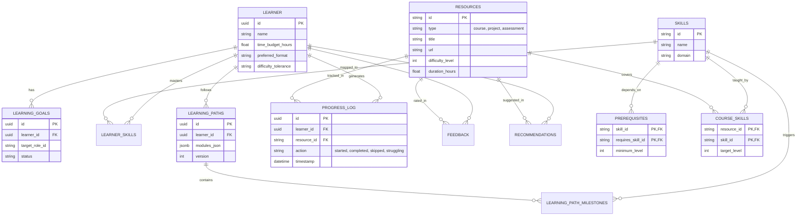

# PathFinder — Data Architecture & Dataset Strategy

---

## 1. Storage Strategy: Relational vs. Vector

To support the Hybrid AI Architecture, PathFinder uses two storage systems working in tandem. 

### 1.1 PostgreSQL (The Source of Truth)
Handles all relational data, transactions, and exact-match filtering.
*   **What goes here:** Learner profiles, structured taxonomy (skills, goals, prerequisites), learning paths, progress tracking, feedback logs, and resource metadata (titles, links, difficulty levels).
*   **Why:** We need transactional integrity for learner progress and deterministic joins for skill-gap calculations.

### 1.2 Supabase pgvector (The Semantic Engine)
Handles unstructured text and semantic similarity retrieval.
*   **What goes here:** Embeddings of the learning resources.
*   **Vector Document:** A concatenated string of `Resource Title + Description + Syllabus + Skills Covered`.
*   **Metadata:** A mirrored subset of the Postgres resource metadata (e.g., `difficulty`, `format_type`, `duration_hours`) used for pre-filtering (filtering *before* nearest-neighbor search) to enforce constraints like time budgets.

---

## 2. Entity Schemas & Data Models

### 2.1 Learner & Profiling
| Entity | Description |
| :--- | :--- |
| **Learner** | The core user record. |
| **Learning Goals** | What the learner wants to achieve (e.g., "Become an ML Engineer"). |
| **Learner Skills** | The learner's current mapped `mastery_map`. |

**Learner**
*   `id` (UUID, PK, Required)
*   `name` (String, Required)
*   `time_budget_hours` (Float, Required): Hours per week.
*   `preferred_format` (Enum, Required): `video`, `article`, `project`, `mixed`.
*   `difficulty_tolerance` (Enum, Required): `low`, `normal`, `high`.
*   *Example:* `{"id": "l_001", "name": "Priya", "time_budget_hours": 10, "preferred_format": "video"}`

**Learning Goals**
*   `id` (UUID, PK, Required)
*   `learner_id` (UUID, FK->Learner, Required)
*   `target_role_id` (String, FK->Roles, Required): E.g., `role_ml_eng`.
*   `deadline_months` (Int, Optional)
*   `status` (Enum, Required): `active`, `completed`, `abandoned`.

**Learner Skills (Mastery Map)**
*   `learner_id` (UUID, FK->Learner, Required)
*   `skill_id` (String, FK->Skills, Required)
*   `mastery_level` (Int, Required): `0` (None) to `3` (Advanced).
*   `last_assessed` (Timestamp, Required)
*   *(Note: Composite PK on `learner_id`, `skill_id`)*

### 2.2 Taxonomy & Ontology
| Entity | Description |
| :--- | :--- |
| **Skills** | The atomic units of knowledge. |
| **Prerequisites** | The DAG edges defining skill dependencies. |

**Skills**
*   `id` (String, PK, Required): E.g., `skill_python_pandas`.
*   `name` (String, Required): E.g., "Pandas Data Manipulation".
*   `domain` (String, Required): E.g., "Data Science".
*   `description` (Text, Optional)

**Prerequisites**
*   `skill_id` (String, FK->Skills, Required): The target skill.
*   `requires_skill_id` (String, FK->Skills, Required): The required prerequisite.
*   `minimum_level` (Int, Required): Minimum mastery needed in the prereq (1-3).
*   *(Note: Composite PK on both IDs. Validated at write-time to prevent DAG cycles).*

### 2.3 Learning Content (The Catalog)
| Entity | Description |
| :--- | :--- |
| **Learning Resources** | Generic base table for all content (Courses, Projects, Assessments). |
| **Courses** | Sub-type for instructional content. |
| **Projects** | Sub-type for applied deliverables. |
| **Assessments** | Sub-type for quizzes/evaluations. |
| **Course-Skill Relationships** | What skills a resource teaches. |

**Learning Resources (Base)**
*   `id` (String, PK, Required): E.g., `res_104`.
*   `type` (Enum, Required): `course`, `project`, `assessment`, `refresher`.
*   `title` (String, Required)
*   `description` (Text, Required)
*   `url` (String, Required)
*   `difficulty_level` (Int, Required): 1 to 3.
*   `duration_hours` (Float, Required)
*   `quality_score` (Float, Required): 0.0 to 5.0 (used in recommendation sorting).

**Course-Skill Relationships**
*   `resource_id` (String, FK->Resources, Required)
*   `skill_id` (String, FK->Skills, Required)
*   `target_level` (Int, Required): The mastery level this resource teaches up to.

*(Note: Courses, Projects, and Assessments share the base `Learning Resources` schema but vary by the `type` enum. Projects emphasize `duration_hours` heavily and evaluate multiple skills simultaneously. Assessments have associated question banks stored in a JSONB column).*

### 2.4 Curriculum & Tracking
| Entity | Description |
| :--- | :--- |
| **Learning Paths** | The generated sequence of modules for a learner. |
| **Learning Path Milestones** | Logical checkpoints in the path. |
| **Progress** | Tracking the state of an active path. |
| **Learning History** | Immutable log of past completions. |
| **Recommendations** | The cached outputs of the scoring engine. |
| **Feedback** | Implicit/Explicit reward signals. |

**Learning Paths**
*   `id` (UUID, PK, Required)
*   `learner_id` (UUID, FK->Learner, Required)
*   `goal_id` (UUID, FK->Learning Goals, Required)
*   `version` (Int, Required): Increments on recalculation.
*   `modules_json` (JSONB, Required): Ordered array of assigned `resource_id`s with `week` assignments.

**Learning Path Milestones**
*   `id` (UUID, PK, Required)
*   `path_id` (UUID, FK->Paths, Required)
*   `title` (String, Required): E.g., "Data Fundamentals Complete".
*   `trigger_skill_id` (String, FK->Skills, Required): The skill that unlocks this milestone.
*   `status` (Enum, Required): `locked`, `unlocked`.

**Progress & Learning History (Module Actions)**
*   `id` (UUID, PK, Required)
*   `learner_id` (UUID, FK->Learner, Required)
*   `resource_id` (String, FK->Resources, Required)
*   `action` (Enum, Required): `started`, `completed`, `skipped`, `struggling`.
*   `score` (Float, Optional): Assessment score if applicable.
*   `timestamp` (Datetime, Required)

**Recommendations (Explanation Cache)**
*   `learner_id` (UUID, FK->Learner, Required)
*   `resource_id` (String, FK->Resources, Required)
*   `scoring_factors` (JSONB, Required): `{semantic: 0.9, difficulty: 0.8, ...}`
*   `explanation_text` (Text, Required): Generated by LLM during path creation.

**Feedback (Reward Matrix)**
*   `learner_id` (UUID, FK->Learner, Required)
*   `resource_id` (String, FK->Resources, Required)
*   `rating` (Int, Required): +1 (Thumbs up), -1 (Thumbs down). Used for `Historical_Reward` scoring.

---

## 3. Seed Dataset Design (The "Cold Start" Solution)

To make the hackathon demo convincing, the system cannot recommend "fake" courses. It must map real-world concepts to real-world-style resources.

### 3.1 Domains & Roles
The MVP dataset will support 4 target roles across 4 domains:
1.  **AI/ML:** `role_ml_engineer`
2.  **Data Science:** `role_data_analyst`
3.  **Web Development:** `role_fullstack_dev`
4.  **Cloud:** `role_cloud_architect`

### 3.2 Skill Taxonomy (Example: ML Engineer)
The dataset will contain ~40 atomic skills linked in a DAG.
*   *Foundations:* `math_linear_algebra`, `math_probability`, `math_calculus`
*   *Programming:* `python_basics`, `python_oop`, `python_pandas`, `python_numpy`
*   *Core ML:* `ml_regression`, `ml_classification`, `ml_clustering`, `ml_evaluation_metrics`
*   *Advanced:* `dl_neural_networks`, `dl_transformers`

### 3.3 Dataset Sourcing & Normalization
*   **Source:** For a hackathon, we will scrape/parse public syllabus outlines from known providers (Coursera, Udemy, YouTube playlists like freeCodeCamp). 
*   **Normalization:** 
    *   Instead of scraping full course videos, we extract the metadata: Title, Description, Syllabus bullet points, and Duration.
    *   We map the syllabus bullet points to our internal `skill_id`s manually for the seed dataset (~100 resources).
*   **Copyright Compliance:** We do not host the content. The `url` field links out to the actual public resource (e.g., a YouTube video or Coursera landing page). We only store metadata for indexing.

---

## 4. Embedding Generation Pipeline

### 4.1 How Embeddings are Generated
1.  A Python script (`scripts/seed_vectordb.py`) connects to the PostgreSQL database (or reads a JSON seed file).
2.  It iterates over all `Learning Resources`.
3.  It constructs a dense textual representation:
    ```python
    document = f"Title: {res.title}. Description: {res.description}. Teaches skills: {', '.join(res.skills_covered)}."
    ```
4.  It passes the document to OpenAI's `text-embedding-3-small` API to get a 1536-dimensional vector.
5.  It inserts the vector and metadata into Supabase pgvector using `langchain-postgres`.

### 4.2 Vector Document Structure (pgvector)
```json
{
  "id": "res_104", // Matches PostgreSQL resource_id
  "embedding": [0.014, -0.052, 0.113, ...], // 1536 dimensions
  "document": "Title: Pandas Data Manipulation. Description: Learn to manipulate DataFrames, handle missing data...",
  "metadata": {
    "difficulty_level": 2,
    "duration_hours": 4.5,
    "format_type": "video",
    "skills_covered": "python_pandas, python_numpy" // Comma-separated for basic filtering
  }
}
```

---

## 5. ER Diagram (Mermaid)



---

## 6. Database Schema (PostgreSQL DDL)

```sql
-- Schema for MVP implementation
CREATE EXTENSION IF NOT EXISTS "uuid-ossp";

CREATE TABLE learners (
    id UUID PRIMARY KEY DEFAULT uuid_generate_v4(),
    name VARCHAR(255) NOT NULL,
    time_budget_hours FLOAT NOT NULL,
    preferred_format VARCHAR(50) DEFAULT 'video',
    difficulty_tolerance VARCHAR(50) DEFAULT 'normal',
    created_at TIMESTAMP DEFAULT CURRENT_TIMESTAMP
);

CREATE TABLE skills (
    id VARCHAR(100) PRIMARY KEY,
    name VARCHAR(255) NOT NULL,
    domain VARCHAR(100) NOT NULL
);

CREATE TABLE prerequisites (
    skill_id VARCHAR(100) REFERENCES skills(id),
    requires_skill_id VARCHAR(100) REFERENCES skills(id),
    minimum_level INT NOT NULL,
    PRIMARY KEY (skill_id, requires_skill_id)
);

CREATE TABLE learner_skills (
    learner_id UUID REFERENCES learners(id),
    skill_id VARCHAR(100) REFERENCES skills(id),
    mastery_level INT DEFAULT 0,
    last_assessed TIMESTAMP DEFAULT CURRENT_TIMESTAMP,
    PRIMARY KEY (learner_id, skill_id)
);

CREATE TABLE resources (
    id VARCHAR(100) PRIMARY KEY,
    type VARCHAR(50) NOT NULL, -- 'course', 'project', 'assessment', 'refresher'
    title VARCHAR(255) NOT NULL,
    description TEXT,
    url VARCHAR(500) NOT NULL,
    difficulty_level INT NOT NULL,
    duration_hours FLOAT NOT NULL,
    quality_score FLOAT DEFAULT 4.0
);

CREATE TABLE course_skills (
    resource_id VARCHAR(100) REFERENCES resources(id),
    skill_id VARCHAR(100) REFERENCES skills(id),
    target_level INT NOT NULL,
    PRIMARY KEY (resource_id, skill_id)
);

CREATE TABLE learning_paths (
    id UUID PRIMARY KEY DEFAULT uuid_generate_v4(),
    learner_id UUID REFERENCES learners(id),
    version INT DEFAULT 1,
    modules_json JSONB NOT NULL,
    created_at TIMESTAMP DEFAULT CURRENT_TIMESTAMP
);

CREATE TABLE progress_log (
    id UUID PRIMARY KEY DEFAULT uuid_generate_v4(),
    learner_id UUID REFERENCES learners(id),
    resource_id VARCHAR(100) REFERENCES resources(id),
    action VARCHAR(50) NOT NULL, -- 'started', 'completed', 'skipped', 'struggling'
    score FLOAT,
    timestamp TIMESTAMP DEFAULT CURRENT_TIMESTAMP
);

CREATE TABLE recommendations_cache (
    learner_id UUID REFERENCES learners(id),
    resource_id VARCHAR(100) REFERENCES resources(id),
    scoring_factors JSONB NOT NULL,
    explanation_text TEXT NOT NULL,
    PRIMARY KEY (learner_id, resource_id)
);
```

---

## 7. Seed Data Structure (Examples)

### 7.1 Skills Seed (`skills.json`)
```json
[
  {
    "id": "math_probability",
    "name": "Probability Theory",
    "domain": "Mathematics"
  },
  {
    "id": "ml_basics",
    "name": "Machine Learning Fundamentals",
    "domain": "AI/ML"
  }
]
```

### 7.2 Prerequisites Seed (`prerequisites.json`)
```json
[
  {
    "skill_id": "ml_basics",
    "requires_skill_id": "math_probability",
    "minimum_level": 1
  },
  {
    "skill_id": "ml_basics",
    "requires_skill_id": "python_pandas",
    "minimum_level": 2
  }
]
```

### 7.3 Resources Seed (`resources.json`)
```json
[
  {
    "id": "res_ml_101",
    "type": "course",
    "title": "Intro to ML with Scikit-Learn",
    "description": "A beginner friendly guide to regression and classification using Python.",
    "url": "https://www.youtube.com/watch?v=example",
    "difficulty_level": 2,
    "duration_hours": 3.5,
    "quality_score": 4.7,
    "skills_covered": [
      {"skill_id": "ml_basics", "target_level": 2}
    ]
  },
  {
    "id": "proj_ml_housing",
    "type": "project",
    "title": "Predict California Housing Prices",
    "description": "End-to-end applied ML project using linear regression.",
    "url": "https://github.com/example/housing",
    "difficulty_level": 2,
    "duration_hours": 8.0,
    "quality_score": 4.9,
    "skills_covered": [
      {"skill_id": "ml_basics", "target_level": 2},
      {"skill_id": "python_pandas", "target_level": 2}
    ]
  },
  {
    "id": "refresher_prob",
    "type": "refresher",
    "title": "Probability in 10 Minutes",
    "description": "Quick review of Bayes theorem and conditional probability.",
    "url": "https://www.youtube.com/watch?v=quick_prob",
    "difficulty_level": 1,
    "duration_hours": 0.2,
    "quality_score": 4.5,
    "skills_covered": [
      {"skill_id": "math_probability", "target_level": 1}
    ]
  }
]
```
*Note: The "Refresher" type is crucial. When the Adaptation Engine detects the learner clicked "Struggling" on `ml_basics`, it queries the DAG, finds `math_probability` is a prerequisite, and queries pgvector for a `refresher` covering `math_probability` (like `refresher_prob`) to inject into the path.*
