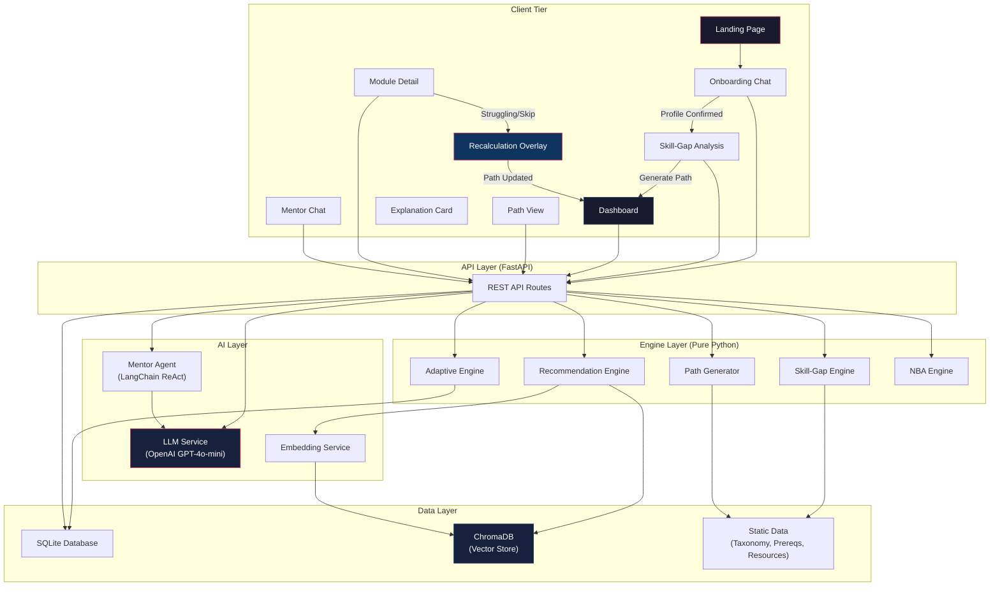

# PathFinder — Technical Architecture Document

---

## 1. High-Level System Architecture

PathFinder is a **monolithic-ish** web application with a clear frontend/backend split. No microservices, no Kubernetes, no message queues — just two deployable units communicating over REST.

```
┌──────────────────────────────────────────────────────────┐
│                      CLIENT TIER                          │
│                                                          │
│   Next.js (React + TypeScript + Tailwind CSS)            │
│   ┌──────────┐ ┌──────────┐ ┌──────────┐ ┌───────────┐  │
│   │ Onboard  │ │ Dashboard│ │ Path View│ │ Mentor    │  │
│   │ Chat     │ │          │ │          │ │ Chat      │  │
│   └──────────┘ └──────────┘ └──────────┘ └───────────┘  │
│          │            │           │            │         │
│          └────────────┴───────────┴────────────┘         │
│                        │ HTTP/REST                        │
└────────────────────────┼─────────────────────────────────┘
                         │
                         ▼
┌────────────────────────┼─────────────────────────────────┐
│                   SERVER TIER                             │
│                                                          │
│   FastAPI (Python)                                       │
│   ┌──────────┐ ┌──────────┐ ┌──────────┐ ┌───────────┐  │
│   │ Onboard  │ │ Skill-Gap│ │ Recommend│ │ Adaptive  │  │
│   │ Service  │ │ Engine   │ │ Engine   │ │ Engine    │  │
│   └──────────┘ └──────────┘ └──────────┘ └───────────┘  │
│   ┌──────────┐ ┌──────────┐ ┌──────────┐                │
│   │ Path Gen │ │ NBA      │ │ Mentor   │                │
│   │ Engine   │ │ Engine   │ │ Agent    │                │
│   └──────────┘ └──────────┘ └──────────┘                │
│          │            │           │                       │
│          └────────────┴───────────┘                       │
│            │              │             │                 │
│            ▼              ▼             ▼                 │
│   ┌──────────┐   ┌──────────┐   ┌───────────┐           │
│   │ Postgres │   │ ChromaDB │   │ LLM API   │           │
│   │ (SQLite  │   │ (local)  │   │ (OpenAI / │           │
│   │  for MVP)│   │          │   │  Gemini)  │           │
│   └──────────┘   └──────────┘   └───────────┘           │
└──────────────────────────────────────────────────────────┘
```

**Key Decisions:**
- **Two deployable units** (frontend + backend), not microservices
- **All engines are Python modules** inside one FastAPI app, not separate services
- **Database starts as SQLite** (zero setup) with clean abstractions to swap to PostgreSQL
- **ChromaDB runs in-process** (embedded mode) — no separate server needed
- **LLM calls go through a single abstraction layer** — swap OpenAI for Gemini with one config change

---

## 2. Component Architecture

### Component Map

```
pathfinder/
├── frontend/                    # Next.js app
│   ├── app/                     # App Router pages
│   │   ├── page.tsx             # Landing page
│   │   ├── onboarding/
│   │   │   └── page.tsx         # Onboarding chat
│   │   ├── dashboard/
│   │   │   └── page.tsx         # Main dashboard
│   │   └── path/
│   │       └── page.tsx         # Full path view
│   ├── components/
│   │   ├── chat/                # Chat UI components
│   │   ├── dashboard/           # Dashboard widgets
│   │   ├── path/                # Timeline components
│   │   ├── charts/              # Radar chart, progress bar
│   │   ├── modules/             # Module detail, explanation card
│   │   └── ui/                  # Shared UI primitives
│   ├── lib/
│   │   ├── api.ts               # API client functions
│   │   └── types.ts             # TypeScript interfaces
│   └── stores/
│       └── learner-store.ts     # Client-side state (Zustand)
│
├── backend/                     # FastAPI app
│   ├── main.py                  # FastAPI app entry + CORS
│   ├── api/
│   │   ├── onboarding.py        # Onboarding endpoints
│   │   ├── learner.py           # Learner CRUD endpoints
│   │   ├── skill_gap.py         # Skill-gap endpoints
│   │   ├── learning_path.py     # Path generation endpoints
│   │   ├── modules.py           # Module action endpoints
│   │   ├── assessment.py        # Assessment endpoints
│   │   ├── dashboard.py         # Dashboard aggregate endpoint
│   │   └── mentor.py            # AI Mentor chat endpoint
│   ├── engines/
│   │   ├── skill_gap.py         # Skill-gap analysis logic
│   │   ├── recommendation.py    # Multi-factor scoring engine
│   │   ├── path_generator.py    # Prerequisite ordering + timeline
│   │   ├── adaptive.py          # Adaptation rules engine
│   │   ├── nba.py               # Next Best Action engine
│   │   └── mentor_agent.py      # LangChain ReAct agent
│   ├── services/
│   │   ├── llm.py               # LLM abstraction layer
│   │   ├── embeddings.py        # Embedding + ChromaDB interface
│   │   └── pdf_parser.py        # Resume/JD extraction
│   ├── models/
│   │   ├── learner.py           # Learner data models (Pydantic)
│   │   ├── path.py              # Path/module models
│   │   └── assessment.py        # Assessment models
│   ├── db/
│   │   ├── database.py          # DB connection (SQLite/Postgres)
│   │   ├── crud.py              # CRUD operations
│   │   └── models.py            # SQLAlchemy ORM models
│   └── data/
│       ├── skill_taxonomy.json  # Roles → skills → proficiency
│       ├── prerequisites.json   # Skill prerequisite graph
│       └── resources.json       # 50-80 curated learning resources
│
├── scripts/
│   ├── seed_vectordb.py         # Seed ChromaDB with resource embeddings
│   └── seed_db.py               # Seed database with initial data
│
├── .env                         # API keys, config
├── docker-compose.yml           # Optional: Postgres + app
└── README.md
```

---

## 3. Technology Evaluation and Selection

### 3A. Frontend: Next.js + TypeScript + Tailwind CSS

| Criterion | Evaluation |
|-----------|-----------|
| **Why we need it** | Rich interactive UI: chat interface, animated timeline, radar charts, real-time dashboard updates. SPA behavior with SSR capability for the landing page. |
| **Why Next.js** | App Router gives file-based routing, built-in API routes (unused — we have FastAPI), React Server Components for fast landing page, and excellent DX with hot reload. |
| **Why TypeScript** | Type safety for API response shapes (learner profile, path data, scoring). Prevents bugs when handling complex nested objects. |
| **Why Tailwind CSS** | Rapid prototyping — utility classes mean no context-switching to CSS files. Built-in responsive design. Dark mode with one class. Hackathon speed. |
| **Alternatives** | Vite + React (lighter, no SSR — fine for hackathon), Vue/Nuxt (less ecosystem), plain HTML/CSS/JS (too slow for complex UI) |
| **Trade-offs** | Next.js is heavier than Vite for a prototype. But App Router simplifies routing and the team likely knows React. If SSR is unnecessary, Vite is a valid swap. |
| **Hackathon Fit** | Excellent. `npx create-next-app` gets a working app in 30 seconds. Tailwind included by default. |

**Key Libraries:**

| Library | Purpose | Why |
|---------|---------|-----|
| `recharts` | Radar chart, progress bar | Simple React-native charting. Easier than Chart.js for React. |
| `zustand` | Client-side state management | Simpler than Redux. One file, no boilerplate. |
| `framer-motion` | Animations (recalculation overlay, timeline transitions) | Best React animation library. "Recalculating Route..." animation. |
| `react-markdown` | Render mentor chat responses | Mentor may return markdown-formatted text. |
| `axios` or `fetch` | API calls | Standard HTTP client. |

---

### 3B. Backend: Python + FastAPI

| Criterion | Evaluation |
|-----------|-----------|
| **Why we need it** | Serve API endpoints, run AI/ML engines, coordinate LLM calls, manage state. |
| **Why Python** | All AI/ML libraries (LangChain, ChromaDB, sentence-transformers, OpenAI SDK) are Python-first. The engines (skill-gap, recommendation, path generation) use Python data structures natively. |
| **Why FastAPI** | Async by default (LLM calls are I/O-bound), automatic OpenAPI docs (great for team coordination and judging), Pydantic model validation (catches bad data), and fast to write. |
| **Alternatives** | Flask (no async, no auto-docs), Django (too heavy), Express.js (would need to rewrite all engines in JS — bad idea when AI libs are Python). |
| **Trade-offs** | Two languages (TS frontend + Python backend) means context-switching. But the AI ecosystem makes Python non-negotiable for the backend. |
| **Hackathon Fit** | Excellent. `pip install fastapi uvicorn` and you have a server. Auto-generated Swagger UI at `/docs` impresses judges. |

**Key Libraries:**

| Library | Purpose | Why |
|---------|---------|-----|
| `pydantic` | Data validation + models | Built into FastAPI. Type-safe request/response. |
| `sqlalchemy` | ORM for database | Works with SQLite and PostgreSQL. Clean abstraction. |
| `langchain`, `langgraph` | LLM integration, stateful agents | Structured output, stateful AI Mentor (LangGraph) integrated inside FastAPI. |
| `chromadb` | Vector database (embedded) | Zero-infra vector search. Runs in-process. |
| `sentence-transformers` | Local embeddings (fallback) | Free embeddings if OpenAI quota runs out. |
| `python-dotenv` | Environment variables | Load `.env` for API keys. |
| `pdfplumber` | PDF text extraction | Better than PyPDF2 for structured PDFs. |
| `uvicorn` | ASGI server | Production-quality server for FastAPI. |

---

### 3C. AI: LLM + Embeddings + Semantic Search

| Component | Technology | Why | Alternative |
|-----------|-----------|-----|------------|
| **LLM Provider** | OpenAI GPT-4o-mini | Best balance of quality/cost/speed. JSON mode for structured output. Function calling for agent. $0.15/1M input tokens. | Google Gemini 1.5 Flash (free tier, slightly less reliable structured output), Groq (fast, free tier, limited models) |
| **Embeddings** | OpenAI `text-embedding-3-small` | 1536 dimensions, $0.02/1M tokens, excellent quality. Same API key as LLM. | `all-MiniLM-L6-v2` via sentence-transformers (free, local, 384 dims, slightly lower quality) |
| **Vector DB** | ChromaDB (embedded mode) | Zero infrastructure. `pip install chromadb`. Runs in-process with SQLite backend. Supports metadata filtering. | Pinecone (cloud, free tier but requires signup), FAISS (no metadata filtering), Qdrant (heavier) |
| **Agent Framework** | LangGraph + LangChain | Stateful graph-based agent pattern for Mentor. Maintains complex conversational state and routes tools deterministically. | Raw OpenAI function calling (simpler but less structured), CrewAI (overkill for one agent) |

**LLM Abstraction Layer Design:**
```python
# backend/services/llm.py
class LLMService:
    """Single abstraction for all LLM calls. Swap provider with one config change."""

    def __init__(self, provider: str = "openai"):
        if provider == "openai":
            self.client = ChatOpenAI(model="gpt-4o-mini", temperature=0)
        elif provider == "gemini":
            self.client = ChatGoogleGenerativeAI(model="gemini-1.5-flash")

    async def extract_profile(self, conversation: list[str]) -> LearnerProfile:
        """Extract structured profile from onboarding conversation."""
        # Uses structured output / JSON mode

    async def explain_recommendation(self, scoring_data: dict) -> str:
        """Generate natural-language explanation from scoring factors."""

    async def generate_assessment(self, skill: str, level: str) -> list[Question]:
        """Generate quiz questions for a skill at a given level."""
```

**Why this matters:** During the hackathon, if OpenAI goes down or quota runs out, change one env var to switch to Gemini. No code changes.

---

### 3D. Database: SQLite (MVP) → PostgreSQL (Production Path)

| Criterion | Evaluation |
|-----------|-----------|
| **Why we need it** | Persist learner profiles, learner state, path data, assessment results, activity logs. |
| **Why SQLite for MVP** | Zero setup. No server process. File-based. Ships with Python. Perfect for single-user hackathon demo. |
| **Why PostgreSQL is the production path** | Multi-user, concurrent writes, JSONB for flexible learner state, full-text search, cloud deployment. |
| **How to keep the door open** | Use SQLAlchemy ORM. All queries go through the ORM. Swap `sqlite:///pathfinder.db` to `postgresql://...` in one line of config. |
| **Trade-offs** | SQLite has no concurrent write support — fine for one demo user, bad for production. |
| **Hackathon Fit** | SQLite is perfect. Zero config, zero deployment friction. |

**Database Schema:**

```sql
-- Core tables
CREATE TABLE learners (
    id TEXT PRIMARY KEY DEFAULT (lower(hex(randomblob(4)))),
    goal TEXT NOT NULL,
    target_role TEXT NOT NULL,
    current_skills JSON NOT NULL,       -- [{"skill_id": "python", "level": 2}]
    time_budget_hours INTEGER NOT NULL,
    deadline_months INTEGER,
    experience_level TEXT NOT NULL,
    preferred_format TEXT DEFAULT 'mixed',
    learner_state JSON NOT NULL,        -- Full continuous state object
    created_at TIMESTAMP DEFAULT CURRENT_TIMESTAMP,
    updated_at TIMESTAMP DEFAULT CURRENT_TIMESTAMP
);

CREATE TABLE learning_paths (
    id TEXT PRIMARY KEY,
    learner_id TEXT REFERENCES learners(id),
    modules JSON NOT NULL,              -- Ordered list of modules
    milestones JSON NOT NULL,           -- Milestone definitions
    estimated_completion TEXT,
    version INTEGER DEFAULT 1,          -- Increments on recalculation
    created_at TIMESTAMP DEFAULT CURRENT_TIMESTAMP
);

CREATE TABLE module_actions (
    id INTEGER PRIMARY KEY AUTOINCREMENT,
    learner_id TEXT REFERENCES learners(id),
    module_id TEXT NOT NULL,
    action TEXT NOT NULL,               -- start | complete | skip | struggling
    score INTEGER,                      -- Assessment score (if applicable)
    created_at TIMESTAMP DEFAULT CURRENT_TIMESTAMP
);

CREATE TABLE chat_history (
    id INTEGER PRIMARY KEY AUTOINCREMENT,
    learner_id TEXT REFERENCES learners(id),
    role TEXT NOT NULL,                  -- user | assistant | system
    content TEXT NOT NULL,
    chat_type TEXT NOT NULL,             -- onboarding | mentor
    created_at TIMESTAMP DEFAULT CURRENT_TIMESTAMP
);
```

**Why JSON columns:** The learner state is deeply nested and changes structure during development. JSON columns (SQLite JSON1 / PostgreSQL JSONB) let us iterate without migrations.

---

### 3E. Vector Search: ChromaDB (Embedded)

| Criterion | Evaluation |
|-----------|-----------|
| **Why we need it** | Semantic search over learning resources. "Find courses about statistics for beginners" should match even if the course title says "Probability and Data Analysis". |
| **Why ChromaDB** | `pip install chromadb`. No server. Runs in-process. Supports metadata filtering (difficulty, type, duration). Persistent storage to disk. |
| **How it works** | At startup, `seed_vectordb.py` embeds all 50-80 resources and stores them. At query time, the Recommendation Engine searches by skill concept + filters by metadata. |
| **Alternatives** | FAISS (no metadata filtering, manual persistence), Pinecone (cloud, free tier, adds external dependency), Qdrant (heavier, Docker required). |
| **Trade-offs** | ChromaDB is not production-grade for millions of vectors. But for 50-80 resources, it is absurdly fast and simple. |

**Seeding Script:**
```python
# scripts/seed_vectordb.py
import chromadb
import json

client = chromadb.PersistentClient(path="./chroma_data")
collection = client.get_or_create_collection("learning_resources")

with open("backend/data/resources.json") as f:
    resources = json.load(f)

collection.add(
    ids=[r["id"] for r in resources],
    documents=[f"{r['title']}. {r['description']}. Skills: {', '.join(r['skills'])}" for r in resources],
    metadatas=[{
        "difficulty": r["difficulty"],
        "type": r["type"],
        "duration_hours": r["duration_hours"],
        "skills": ",".join(r["skills"])
    } for r in resources]
)
```

---

### 3F. Authentication: None (MVP) → Simple Token (If Needed)

| Criterion | Evaluation |
|-----------|-----------|
| **Why skip auth for MVP** | Single demo user. No multi-user support needed. Auth adds zero demo value and costs development time. |
| **If we need it later** | Simple API key in header (`X-Learner-ID: learner_001`). No OAuth, no JWT, no sessions. |
| **For judges** | If asked about auth, say: "We scoped auth as a non-goal for the prototype. Our architecture supports adding JWT via FastAPI's dependency injection in production." |

---

### 3G. Deployment: Local Demo (Primary) + Cloud Backup

| Option | Setup | Cost | When to Use |
|--------|-------|------|-------------|
| **Local (Primary)** | `npm run dev` + `uvicorn main:app` | Free | Default for hackathon demo |
| **Vercel (Frontend)** | `vercel deploy` | Free tier | If remote demo needed |
| **Render (Backend)** | Push to GitHub, auto-deploy | Free tier (spins down after inactivity) | If remote demo needed |
| **Railway** | Push to GitHub, auto-deploy | $5 credit free | Alternative to Render |

**Recommendation:** Demo locally. Deploy to Vercel + Render only if the hackathon requires a live URL.

---

## 4. Frontend Architecture

### State Management

```
┌─────────────────────────────────────────┐
│            Zustand Store                 │
│                                         │
│  learnerStore:                          │
│    ├── profile: LearnerProfile | null   │
│    ├── skillGap: SkillGap | null        │
│    ├── path: LearningPath | null        │
│    ├── dashboard: DashboardData | null  │
│    ├── nba: NextBestAction | null       │
│    ├── chatHistory: ChatMessage[]       │
│    └── isRecalculating: boolean         │
│                                         │
│  Actions:                               │
│    ├── setProfile(profile)              │
│    ├── updateModuleStatus(id, action)   │
│    ├── triggerRecalculation()           │
│    └── addChatMessage(msg)             │
└─────────────────────────────────────────┘
```

**Why Zustand:** One file, no boilerplate, no providers. State is accessible from any component via hooks. Perfect for hackathon speed.

### Key TypeScript Interfaces

```typescript
// frontend/lib/types.ts

interface LearnerProfile {
  id: string;
  goal: string;
  target_role: string;
  current_skills: Skill[];
  time_budget_hours: number;
  deadline_months: number;
  experience_level: 'beginner' | 'intermediate' | 'advanced';
  preferred_format: 'video' | 'article' | 'project' | 'mixed';
}

interface Skill {
  skill_id: string;
  name: string;
  level: number; // 0=None, 1=Beginner, 2=Intermediate, 3=Advanced
}

interface SkillGap {
  labels: string[];
  current: number[];
  required: number[];
  gaps: GapItem[];
}

interface GapItem {
  skill_id: string;
  name: string;
  current_level: number;
  required_level: number;
  severity: 'high' | 'medium' | 'low';
  priority: number;
}

interface LearningPath {
  id: string;
  modules: PathModule[];
  milestones: Milestone[];
  estimated_completion: string;
  version: number;
}

interface PathModule {
  id: string;
  title: string;
  description: string;
  skill_id: string;
  difficulty: 'beginner' | 'intermediate' | 'advanced';
  duration_hours: number;
  type: 'video' | 'article' | 'project';
  url: string;
  provider: string;
  status: 'not_started' | 'in_progress' | 'completed' | 'skipped' | 'struggling';
  week: number;
  scoring: ScoringBreakdown;
  explanation_summary: string;
}

interface ScoringBreakdown {
  skill_relevance: number;
  difficulty_fit: number;
  time_fit: number;
  format_match: number;
  prerequisite_readiness: number;
  historical_reward: number;
  overall: number;
}

interface NextBestAction {
  type: 'continue' | 'review' | 'priority' | 'celebrate' | 'help';
  title: string;
  description: string;
  module_id: string | null;
}

interface DashboardData {
  profile: LearnerProfile;
  skill_gap: SkillGap;
  path: LearningPath;
  nba: NextBestAction;
  progress: { completed: number; total: number; percentage: number };
  milestones: Milestone[];
  recent_activity: ActivityItem[];
}
```

### Page Routing (Next.js App Router)

| Route | Page | Purpose |
|-------|------|---------|
| `/` | Landing | Hero + CTA |
| `/onboarding` | Onboarding Chat | Chat-based profile creation |
| `/skill-gap` | Skill-Gap Analysis | Radar chart + gap table + "Generate Path" CTA |
| `/dashboard` | Dashboard | Main hub (default after onboarding) |
| `/path` | Full Path View | Expanded timeline view |

---

## 5. Backend Architecture

### FastAPI Application Structure

```python
# backend/main.py
from fastapi import FastAPI
from fastapi.middleware.cors import CORSMiddleware
from api import onboarding, learner, skill_gap, learning_path, modules, assessment, dashboard, mentor

app = FastAPI(title="PathFinder API", version="1.0.0")

app.add_middleware(
    CORSMiddleware,
    allow_origins=["http://localhost:3000"],
    allow_methods=["*"],
    allow_headers=["*"],
)

app.include_router(onboarding.router, prefix="/api/onboarding", tags=["Onboarding"])
app.include_router(learner.router, prefix="/api/learner", tags=["Learner"])
app.include_router(skill_gap.router, prefix="/api/skill-gap", tags=["Skill Gap"])
app.include_router(learning_path.router, prefix="/api/learning-path", tags=["Learning Path"])
app.include_router(modules.router, prefix="/api/module", tags=["Modules"])
app.include_router(assessment.router, prefix="/api/assessment", tags=["Assessment"])
app.include_router(dashboard.router, prefix="/api/dashboard", tags=["Dashboard"])
app.include_router(mentor.router, prefix="/api/mentor", tags=["AI Mentor"])
```

### Engine Layer (Pure Logic — No Framework Dependencies)

Every engine is a **plain Python module** with no FastAPI or database dependencies. They receive data in, return data out. This makes them testable, swappable, and easy to reason about.

```python
# Example: backend/engines/skill_gap.py
class SkillGapEngine:
    def __init__(self, taxonomy: dict):
        self.taxonomy = taxonomy

    def analyze(self, target_role: str, current_skills: list[dict]) -> SkillGapResult:
        required = self.taxonomy["roles"][target_role]["required_skills"]
        current_map = {s["skill_id"]: s["level"] for s in current_skills}
        gaps = []
        for skill in required:
            current_level = current_map.get(skill["skill_id"], 0)
            gap = skill["required_level"] - current_level
            if gap > 0:
                gaps.append({
                    "skill_id": skill["skill_id"],
                    "name": skill["name"],
                    "current_level": current_level,
                    "required_level": skill["required_level"],
                    "gap": gap,
                    "severity": "high" if gap >= 2 else "medium" if gap == 1 else "low"
                })
        # Priority sort: topological depth * 0.6 + severity * 0.4
        gaps.sort(key=lambda g: g["gap"], reverse=True)
        return SkillGapResult(gaps=gaps, labels=..., current=..., required=...)
```

---

## 6. AI Architecture

### AI Component Map

```
┌─────────────────────────────────────────────────────────────┐
│                     AI ARCHITECTURE                          │
│                                                             │
│  ┌──────────────────────────────────────────────────────┐   │
│  │                LLM ABSTRACTION LAYER                  │   │
│  │   llm.py — unified interface to OpenAI / Gemini       │   │
│  │                                                       │   │
│  │   Methods:                                            │   │
│  │   ├── extract_profile(conversation) → JSON            │   │
│  │   ├── explain_recommendation(scoring) → str           │   │
│  │   ├── parse_resume(text) → skills[]                   │   │
│  │   ├── parse_jd(text) → target_skills[]                │   │
│  │   └── generate_questions(skill, level) → questions[]  │   │
│  └──────────────────────────────────────────────────────┘   │
│                         │                                    │
│         ┌───────────────┼───────────────┐                    │
│         ▼               ▼               ▼                    │
│  ┌────────────┐  ┌────────────┐  ┌──────────────┐           │
│  │ Onboarding │  │ Explanation│  │  AI Mentor   │           │
│  │ NLU        │  │ Generator  │  │  LangGraph   │           │
│  │            │  │            │  │  State Agent │           │
│  │ Input:     │  │ Input:     │  │ Tools:       │           │
│  │ chat text  │  │ score data │  │ get_progress │           │
│  │            │  │            │  │ get_skill_gap│           │
│  │ Output:    │  │ Output:    │  │ get_recs     │           │
│  │ JSON       │  │ text       │  │ mark_done    │           │
│  │ profile    │  │ explain    │  │ skip_module  │           │
│  └────────────┘  └────────────┘  │ recalculate  │           │
│                                  └──────────────┘           │
│                                                             │
│  ┌──────────────────────────────────────────────────────┐   │
│  │              EMBEDDING + VECTOR SEARCH                │   │
│  │   embeddings.py — ChromaDB interface                  │   │
│  │                                                       │   │
│  │   Methods:                                            │   │
│  │   ├── search_resources(query, filters) → results[]    │   │
│  │   └── get_similar(resource_id, k) → results[]         │   │
│  └──────────────────────────────────────────────────────┘   │
│                                                             │
│  ┌──────────────────────────────────────────────────────┐   │
│  │             ALGORITHMIC ENGINES (No AI)               │   │
│  │                                                       │   │
│  │   skill_gap.py      — array comparison + priority     │   │
│  │   recommendation.py — multi-factor weighted scoring   │   │
│  │   path_generator.py — topological sort + timeline     │   │
│  │   adaptive.py       — rule-based trigger engine       │   │
│  │   nba.py            — state-based action selection    │   │
│  └──────────────────────────────────────────────────────┘   │
└─────────────────────────────────────────────────────────────┘
```

### What Uses AI vs. What Uses Algorithms

| Component | AI (LLM/Embeddings) | Algorithm (Deterministic) | Why This Split |
|-----------|---------------------|---------------------------|----------------|
| Profile extraction | LLM structured output | — | Natural language requires LLM |
| Skill-gap detection | — | Array diff + priority sort | Must be deterministic |
| Resource retrieval | Embedding similarity search | Metadata filtering | Semantic matching needs embeddings |
| Recommendation scoring | — | Weighted multi-factor formula | Must be transparent + reproducible |
| Recommendation explanation | LLM text generation | — | Natural language output |
| Prerequisite ordering | — | Topological sort (DAG) | Must never hallucinate order |
| Timeline generation | — | Duration accumulation | Pure math |
| Adaptation | — | Rule-based trigger engine | Must be predictable |
| NBA | — | State machine | Deterministic per state |
| Mentor | LangGraph Stateful Agent | — | Needs reasoning, state memory + tool-calling |

---

## 7. Recommendation Engine Architecture

```
┌─────────────────────────────────────────────────┐
│           RECOMMENDATION ENGINE                   │
│                                                   │
│  INPUT: skill_gap_item + learner_state            │
│                                                   │
│  ┌───────────────────────────────────────────┐    │
│  │  STAGE 1: RETRIEVAL (AI)                   │    │
│  │                                           │    │
│  │  ChromaDB.query(                          │    │
│  │    query_text = skill_gap.name,           │    │
│  │    n_results = 10,                        │    │
│  │    where = {                              │    │
│  │      "difficulty": {"$in": [level, +-1]}, │    │
│  │      "duration_hours": {"$lte": budget}   │    │
│  │    }                                      │    │
│  │  ) → candidates[]                         │    │
│  └─────────────────┬─────────────────────────┘    │
│                    │                              │
│                    ▼                              │
│  ┌───────────────────────────────────────────┐    │
│  │  STAGE 2: SCORING (Algorithm)              │    │
│  │                                           │    │
│  │  For each candidate:                      │    │
│  │    score = (                               │    │
│  │      skill_relevance  * 0.30 +            │    │
│  │      prereq_readiness * 0.20 +            │    │
│  │      difficulty_fit   * 0.15 +            │    │
│  │      time_fit         * 0.15 +            │    │
│  │      format_match     * 0.10 +            │    │
│  │      historical_reward* 0.10              │    │
│  │    )                                      │    │
│  │  Sort by score descending                 │    │
│  │  Return top 3                             │    │
│  └─────────────────┬─────────────────────────┘    │
│                    │                              │
│                    ▼                              │
│  OUTPUT: ranked_resources[] with scoring data     │
└─────────────────────────────────────────────────┘
```

### Scoring Factor Computation

```python
def compute_skill_relevance(resource_skills: list, gap_skill: str) -> float:
    """1.0 if resource directly covers the gap skill, 0.5 for related skills."""
    if gap_skill in resource_skills:
        return 1.0
    return 0.3  # Tangential match from vector similarity

def compute_difficulty_fit(resource_diff: int, learner_level: int, tolerance: str) -> float:
    """1.0 for exact match, penalize for mismatch."""
    diff = abs(resource_diff - learner_level)
    if diff == 0: return 1.0
    if diff == 1: return 0.7
    return 0.3

def compute_time_fit(resource_hours: float, weekly_budget: float) -> float:
    """1.0 if fits in one week, lower if spans multiple weeks."""
    if resource_hours <= weekly_budget: return 1.0
    if resource_hours <= weekly_budget * 2: return 0.7
    return 0.4

def compute_format_match(resource_type: str, preferred: str) -> float:
    """1.0 for preferred format, 0.6 for others."""
    if preferred == "mixed": return 0.8
    return 1.0 if resource_type == preferred else 0.6

def compute_historical_reward(resource_id: str, learner_rewards: dict) -> float:
    """0.5 default, adjusted by past feedback on similar resources."""
    return learner_rewards.get(resource_id, 0.5)
```

---

## 8. Skill-Gap Engine

```python
class SkillGapEngine:
    """Deterministic skill-gap analysis. No LLM involved."""

    def __init__(self, taxonomy_path: str):
        with open(taxonomy_path) as f:
            self.taxonomy = json.load(f)

    def analyze(self, target_role: str, current_skills: list[dict]) -> dict:
        # 1. Get required skills for role
        required = self.taxonomy["roles"][target_role]["required_skills"]

        # 2. Build current skill map
        current_map = {s["skill_id"]: s["level"] for s in current_skills}

        # 3. Compute gaps
        gaps = []
        labels, current_vals, required_vals = [], [], []

        for req in required:
            curr = current_map.get(req["skill_id"], 0)
            gap = req["required_level"] - curr
            labels.append(req["name"])
            current_vals.append(curr)
            required_vals.append(req["required_level"])

            if gap > 0:
                gaps.append({
                    "skill_id": req["skill_id"],
                    "name": req["name"],
                    "current_level": curr,
                    "required_level": req["required_level"],
                    "gap": gap,
                    "severity": self._severity(gap),
                    "priority": self._priority(req["skill_id"], gap)
                })

        # 4. Sort by priority (highest first)
        gaps.sort(key=lambda g: g["priority"], reverse=True)

        return {
            "gaps": gaps,
            "radar": {"labels": labels, "current": current_vals, "required": required_vals}
        }

    def _severity(self, gap: int) -> str:
        if gap >= 2: return "high"
        if gap == 1: return "medium"
        return "low"

    def _priority(self, skill_id: str, gap: int) -> float:
        depth = self._topological_depth(skill_id)
        return depth * 0.6 + gap * 0.4

    def _topological_depth(self, skill_id: str) -> int:
        """How many skills depend on this one? Higher = more important."""
        prereqs = self.taxonomy.get("prerequisites", {})
        count = sum(1 for deps in prereqs.values() if skill_id in deps)
        return count
```

---

## 9. Learning-Path Generation Engine

```python
from collections import deque

class PathGenerator:
    """Generates prerequisite-aware, timeline-fitted learning paths."""

    def __init__(self, prerequisites: dict, milestones_config: dict):
        self.prerequisites = prerequisites  # {"ml_basics": ["statistics", "python"], ...}
        self.milestones_config = milestones_config

    def generate(self, gaps: list[dict], resources: dict,
                 weekly_hours: int, known_skills: set) -> dict:

        # 1. Build subgraph of only gap skills
        gap_ids = {g["skill_id"] for g in gaps}
        subgraph = {
            skill: [p for p in self.prerequisites.get(skill, []) if p in gap_ids]
            for skill in gap_ids
        }

        # 2. Topological sort (Kahn's algorithm)
        ordered = self._topological_sort(subgraph)

        # 3. Assign resources and build timeline
        modules = []
        current_week = 1
        hours_in_week = 0

        for skill_id in ordered:
            if skill_id in known_skills:
                continue  # Skip known skills

            resource = resources.get(skill_id)
            if not resource:
                continue

            # Fit into weeks
            if hours_in_week + resource["duration_hours"] > weekly_hours:
                current_week += 1
                hours_in_week = 0

            modules.append({
                "id": f"mod_{skill_id}",
                "skill_id": skill_id,
                "title": resource["title"],
                "description": resource["description"],
                "duration_hours": resource["duration_hours"],
                "difficulty": resource["difficulty"],
                "type": resource["type"],
                "url": resource["url"],
                "provider": resource.get("provider", ""),
                "status": "not_started",
                "week": current_week,
                "scoring": resource["scoring"]
            })
            hours_in_week += resource["duration_hours"]

        # 4. Insert milestones
        milestones = self._insert_milestones(modules)

        # 5. Estimate completion
        total_weeks = modules[-1]["week"] if modules else 0
        est_months = round(total_weeks / 4.33, 1)

        return {
            "modules": modules,
            "milestones": milestones,
            "estimated_weeks": total_weeks,
            "estimated_months": est_months
        }

    def _topological_sort(self, graph: dict) -> list:
        in_degree = {node: 0 for node in graph}
        for node, deps in graph.items():
            for dep in deps:
                if dep in in_degree:
                    in_degree[node] = in_degree.get(node, 0)
                # dep must come before node — dep has node as dependent
        # Kahn's algorithm
        for node, deps in graph.items():
            for dep in deps:
                pass  # Count incoming edges
        # ... standard implementation
        queue = deque([n for n, d in in_degree.items() if d == 0])
        result = []
        while queue:
            node = queue.popleft()
            result.append(node)
            for dependent, deps in graph.items():
                if node in deps:
                    in_degree[dependent] -= 1
                    if in_degree[dependent] == 0:
                        queue.append(dependent)
        return result
```

---

## 10. Adaptive Learning Engine

```python
class AdaptiveEngine:
    """Rule-based adaptation engine. No ML — just clear trigger-response rules."""

    def evaluate(self, trigger: str, module_id: str,
                 learner_state: dict, current_path: dict,
                 score: int = None) -> AdaptationResult:

        if trigger == "struggling":
            return self._handle_struggling(module_id, current_path)

        elif trigger == "skip":
            return self._handle_skip(module_id, learner_state, current_path)

        elif trigger == "complete" and score is not None:
            if score >= 80:
                return self._handle_high_score(module_id, learner_state, current_path)
            elif score < 50:
                return self._handle_low_score(module_id, learner_state, current_path)

        return AdaptationResult(changed=False)

    def _handle_struggling(self, module_id, path):
        """Insert prerequisite refresher before current module."""
        module = self._find_module(module_id, path)
        prereqs = self.prerequisites.get(module["skill_id"], [])

        if prereqs:
            refresher_skill = prereqs[0]  # First prerequisite
            refresher = self._find_refresher_resource(refresher_skill)
            return AdaptationResult(
                changed=True,
                action="insert_before",
                target_module=module_id,
                new_module=refresher,
                message=f"Added {refresher['title']} to help with {module['title']}"
            )
        return AdaptationResult(changed=False)

    def _handle_skip(self, module_id, learner_state, path):
        """Remove module, bump mastery, compress timeline."""
        module = self._find_module(module_id, path)
        return AdaptationResult(
            changed=True,
            action="remove",
            target_module=module_id,
            mastery_update={module["skill_id"]: "+1"},
            message=f"Skipped {module['title']}. Timeline compressed."
        )

    def _handle_high_score(self, module_id, learner_state, path):
        """Check if next modules can be compressed or skipped."""
        # Look at next 2 modules — if they cover similar skills, offer to skip
        return AdaptationResult(
            changed=True,
            action="compress",
            message="Great score! Checking if we can accelerate your path..."
        )

    def _handle_low_score(self, module_id, learner_state, path):
        """Insert refresher for the weak area."""
        module = self._find_module(module_id, path)
        return AdaptationResult(
            changed=True,
            action="insert_before_next",
            message=f"Score was {score}%. Adding a refresher before the next topic."
        )
```

---

## 11. Database Architecture

### Entity Relationship

```
┌──────────────┐       ┌──────────────────┐
│   learners   │       │  learning_paths   │
│──────────────│       │──────────────────│
│ id (PK)      │──┐    │ id (PK)          │
│ goal         │  │    │ learner_id (FK)  │──┐
│ target_role  │  └───>│ modules (JSON)   │  │
│ current_skills│      │ milestones (JSON)│  │
│ time_budget  │       │ version          │  │
│ learner_state│       │ created_at       │  │
│ created_at   │       └──────────────────┘  │
│ updated_at   │                             │
└──────────────┘       ┌──────────────────┐  │
        │              │  module_actions   │  │
        │              │──────────────────│  │
        └─────────────>│ id (PK)          │  │
                       │ learner_id (FK)  │<─┘
                       │ module_id        │
                       │ action           │
                       │ score            │
                       │ created_at       │
                       └──────────────────┘

                       ┌──────────────────┐
                       │  chat_history     │
                       │──────────────────│
                       │ id (PK)          │
                       │ learner_id (FK)  │
                       │ role             │
                       │ content          │
                       │ chat_type        │
                       │ created_at       │
                       └──────────────────┘
```

**Design Decision: JSON columns for complex nested data.** The learner state and module list are deeply nested objects that change shape during development. Using JSON columns avoids migration hell during a hackathon.

---

## 12. API Architecture

### Endpoint Specification

```
BASE URL: http://localhost:8000/api

ONBOARDING
  POST /onboarding/chat
    Body: { learner_id?: string, message: string, history: ChatMessage[] }
    Response: { reply: string, profile: LearnerProfile | null, is_complete: boolean }

  POST /onboarding/upload
    Body: FormData { resume?: File, jd_text?: string }
    Response: { current_skills: Skill[], target_skills: Skill[] }

LEARNER
  POST /learner
    Body: LearnerProfile
    Response: { id: string, ...LearnerProfile }

  GET /learner/{id}
    Response: LearnerProfile + LearnerState

SKILL GAP
  GET /skill-gap/{learner_id}
    Response: { gaps: GapItem[], radar: RadarData }

LEARNING PATH
  GET /learning-path/{learner_id}
    Response: LearningPath

  POST /learning-path/{learner_id}/generate
    Response: LearningPath

MODULE
  GET /module/{module_id}?learner_id={id}
    Response: ModuleDetail + ScoringBreakdown

  GET /module/{module_id}/explanation?learner_id={id}
    Response: { scoring: ScoringBreakdown, explanation: string }

  POST /module/{module_id}/action
    Body: { learner_id: string, action: "start"|"complete"|"skip"|"struggling", score?: int }
    Response: { updated_path: LearningPath, adaptation: AdaptationResult, nba: NextBestAction }

ASSESSMENT
  GET /assessment/{module_id}
    Response: { questions: Question[] }

  POST /assessment/{module_id}/submit
    Body: { learner_id: string, answers: Answer[] }
    Response: { score: int, mastery_update: MasteryUpdate, adaptation: AdaptationResult }

DASHBOARD
  GET /dashboard/{learner_id}
    Response: DashboardData

MENTOR
  POST /mentor/chat
    Body: { learner_id: string, message: string, history: ChatMessage[] }
    Response: { reply: string, action_taken?: ActionResult }
```

---

## 13. Data Flow

### Complete Request Flow: Onboarding to Dashboard

```
User types goal → Frontend sends POST /onboarding/chat
    │
    ▼
Backend receives message → LLM extracts profile (JSON mode)
    │
    ├── Profile complete? → Return profile for confirmation
    │
    └── Incomplete? → Return follow-up question
    │
    ▼ (after confirmation)
Frontend sends POST /learner (save profile)
    │
    ▼
Backend saves to DB → Returns learner_id
    │
    ▼
Frontend calls GET /skill-gap/{learner_id}
    │
    ▼
Backend: SkillGapEngine.analyze(target_role, current_skills)
    │
    ▼
Returns gap data → Frontend renders Radar Chart
    │
    ▼
Frontend calls POST /learning-path/{learner_id}/generate
    │
    ▼
Backend:
  1. RecommendationEngine.retrieve(gap_skills) → ChromaDB semantic search
  2. RecommendationEngine.score(candidates, learner_state) → ranked resources
  3. PathGenerator.generate(gaps, resources, weekly_hours) → ordered path
  4. LLMService.explain_recommendation(scoring) → explanation text per module
    │
    ▼
Returns LearningPath → Frontend renders timeline
    │
    ▼
Frontend calls GET /dashboard/{learner_id}
    │
    ▼
Backend composes: profile + gap + path + NBA + progress + milestones + activity
    │
    ▼
Returns DashboardData → Frontend renders full dashboard
```

### Adaptation Flow

```
User clicks "Struggling" → Frontend POST /module/{id}/action {action: "struggling"}
    │
    ▼
Backend:
  1. AdaptiveEngine.evaluate("struggling", module_id, learner_state, path)
  2. If changed: PathGenerator.regenerate(updated_gaps, ...) or insert module
  3. NBAEngine.compute(updated_state) → new NBA
  4. Update learner_state in DB
  5. Update learning_path in DB (version++)
    │
    ▼
Response: { updated_path, adaptation: {changed: true, message: "..."}, nba }
    │
    ▼
Frontend:
  1. Shows "Recalculating Route..." overlay (framer-motion)
  2. After 2s, updates timeline with new path
  3. Updates NBA card
  4. If mentor enabled, shows proactive message
```

---

## 14. Error Handling Strategy

| Error Type | Where | Handling | User Impact |
|-----------|-------|---------|-------------|
| LLM API timeout | Backend → LLM | Retry once (3s timeout), then return cached/fallback response | Slight delay, graceful degradation |
| LLM API rate limit | Backend → LLM | Queue request, retry after backoff, fallback to simpler prompt | "Processing... please wait" |
| LLM returns invalid JSON | Backend → LLM | Retry with stricter prompt, then return partial profile + ask for manual input | "I couldn't fully understand. Could you clarify [specific field]?" |
| ChromaDB search returns 0 results | Backend → ChromaDB | Broaden search (remove filters), then fallback to random resource for that skill | "I found a general resource for this topic" |
| Database write fails | Backend → DB | Retry once, then return error | "Something went wrong saving. Please try again." |
| Frontend API call fails | Frontend → Backend | Show toast error, retain current state, allow retry | "Connection issue. Retrying..." |
| Invalid learner_id | Backend → API | Return 404 with clear message | Redirect to onboarding |
| Prerequisite graph has cycle | Backend → PathGen | Detect cycle, break at weakest edge, log warning | Path generated with warning |

### Backend Error Response Format

```json
{
  "error": true,
  "code": "LLM_TIMEOUT",
  "message": "AI service is temporarily slow. Using cached response.",
  "fallback_used": true,
  "data": { }
}
```

---

## 15. Security Considerations

| Concern | Mitigation | Priority |
|---------|-----------|----------|
| API keys exposed in frontend | All LLM/embedding calls go through backend. Frontend never touches API keys. | Critical |
| Env variable management | `.env` file loaded via `python-dotenv`. `.env` in `.gitignore`. | Critical |
| CORS | Restrict to `localhost:3000` (and deployed frontend URL if applicable). | High |
| Input injection (prompt injection) | System prompts are server-side. User input is treated as user messages, never concatenated into system prompts. | High |
| SQL injection | SQLAlchemy ORM parameterizes all queries. No raw SQL. | High |
| File upload security | Validate file type (PDF only), limit file size (5MB), process in sandbox. | Medium (stretch feature) |
| Rate limiting | Not needed for hackathon. In production: FastAPI middleware. | Low (non-goal) |

---

## 16. Logging and Monitoring

**Hackathon-appropriate logging — not production observability.**

```python
import logging

logging.basicConfig(
    level=logging.INFO,
    format="%(asctime)s [%(levelname)s] %(name)s: %(message)s"
)
logger = logging.getLogger("pathfinder")

# Log every AI decision for demo/debugging
logger.info(f"Skill-gap analysis: {len(gaps)} gaps found for role={target_role}")
logger.info(f"Recommendation scoring: top resource={top.title}, score={top.score}")
logger.info(f"Adaptation triggered: {trigger} on module={module_id}, action={result.action}")
logger.info(f"NBA updated: {nba.type} - {nba.title}")
```

**Why log AI decisions:** During the demo, if a judge asks "Why did it recommend X?", you can pull up the log showing exact scoring factors. This proves the system is genuinely intelligent, not random.

---

## 17. Scalability Considerations

**For hackathon: irrelevant. For PRD completeness and judge questions:**

| Concern | Current (Hackathon) | Production Path |
|---------|---------------------|-----------------|
| Database | SQLite (1 user) | PostgreSQL (multi-user, connection pooling) |
| Vector DB | ChromaDB embedded (80 resources) | Pinecone or Qdrant (millions of resources) |
| LLM calls | Direct API calls | Queue + cache layer (Redis) |
| Concurrent users | 1 | FastAPI async + horizontal scaling |
| Resource DB | 50-80 JSON entries | Postgres + regular web scraping pipeline |
| Caching | None | Redis for LLM responses, dashboard data |

**Judge-ready answer:** "We designed the architecture with clean abstractions — the DB, vector store, and LLM provider are all behind interfaces. Swapping SQLite for PostgreSQL is a one-line config change. The engines are stateless pure functions, so horizontal scaling is straightforward."

---

## 18. Recommended Final Tech Stack

| Layer | Technology | Version | Why |
|-------|-----------|---------|-----|
| **Frontend** | Next.js | 14+ (App Router) | File-based routing, React Server Components, fast DX |
| **Language** | TypeScript | 5+ | Type safety for complex data shapes |
| **Styling** | Tailwind CSS | 3+ | Rapid prototyping, dark mode, responsive |
| **Charts** | Recharts | 2+ | React-native charting, radar chart support |
| **Animation** | Framer Motion | 10+ | "Recalculating Route..." overlay, timeline transitions |
| **State** | Zustand | 4+ | Minimal boilerplate state management |
| **Backend** | FastAPI | 0.100+ | Async, auto-docs, Pydantic validation |
| **Language** | Python | 3.11+ | AI ecosystem, f-strings, type hints |
| **ORM** | SQLAlchemy | 2+ | DB abstraction (SQLite ↔ PostgreSQL) |
| **Database** | SQLite | 3 | Zero setup, file-based, hackathon speed |
| **Vector DB** | ChromaDB | 0.4+ | Embedded, zero infra, metadata filtering |
| **LLM** | OpenAI GPT-4o-mini | — | Quality/cost/speed balance, JSON mode, function calling |
| **Embeddings** | OpenAI text-embedding-3-small | — | 1536 dims, same API key, cheap |
| **Agent** | LangChain + LangGraph | 0.2+ | ReAct agent, tool definitions, structured output |
| **PDF** | pdfplumber | 0.10+ | Better than PyPDF2 for structured text |
| **Deployment** | Local (primary) | — | Zero friction for demo |
| **Backup Deploy** | Vercel + Render | Free tier | If remote URL needed |

---

## 19. Architecture Diagram (Mermaid)



---

## 20. Component List

### Frontend Components (19)

| # | Component | File | Purpose |
|---|-----------|------|---------|
| 1 | LandingHero | `components/landing/hero.tsx` | Animated hero section + CTA |
| 2 | ChatInterface | `components/chat/chat-interface.tsx` | Reusable chat UI (onboarding + mentor) |
| 3 | ChatMessage | `components/chat/chat-message.tsx` | Single message bubble |
| 4 | ChatInput | `components/chat/chat-input.tsx` | Text input + send button |
| 5 | ProfileCard | `components/onboarding/profile-card.tsx` | Editable profile summary |
| 6 | RadarChart | `components/charts/radar-chart.tsx` | Skill gap spider chart |
| 7 | GapTable | `components/charts/gap-table.tsx` | Skill gap severity table |
| 8 | ProgressBar | `components/dashboard/progress-bar.tsx` | Overall completion bar |
| 9 | NBACard | `components/dashboard/nba-card.tsx` | Next Best Action hero card |
| 10 | PathTimeline | `components/path/path-timeline.tsx` | Interactive learning path timeline |
| 11 | ModuleCard | `components/path/module-card.tsx` | Single module on timeline |
| 12 | ModuleDetail | `components/modules/module-detail.tsx` | Full module info + action buttons |
| 13 | ExplanationCard | `components/modules/explanation-card.tsx` | "Why This?" scoring breakdown |
| 14 | MilestoneCard | `components/dashboard/milestone-card.tsx` | Milestone with lock state |
| 15 | ActivityFeed | `components/dashboard/activity-feed.tsx` | Recent actions list |
| 16 | RecalcOverlay | `components/ui/recalc-overlay.tsx` | "Recalculating Route..." animation |
| 17 | AssessmentQuiz | `components/modules/assessment-quiz.tsx` | Quick quiz modal |
| 18 | MentorFAB | `components/chat/mentor-fab.tsx` | Floating chat button |
| 19 | MentorPanel | `components/chat/mentor-panel.tsx` | Slide-over mentor chat |

### Backend Modules (15)

| # | Module | File | Purpose |
|---|--------|------|---------|
| 1 | Main App | `main.py` | FastAPI app + CORS + router registration |
| 2 | Onboarding API | `api/onboarding.py` | Chat + upload endpoints |
| 3 | Learner API | `api/learner.py` | CRUD endpoints |
| 4 | Skill-Gap API | `api/skill_gap.py` | Gap analysis endpoint |
| 5 | Path API | `api/learning_path.py` | Path generation + retrieval |
| 6 | Module API | `api/modules.py` | Module actions (start/complete/skip/struggle) |
| 7 | Assessment API | `api/assessment.py` | Quiz generation + scoring |
| 8 | Dashboard API | `api/dashboard.py` | Aggregate dashboard data |
| 9 | Mentor API | `api/mentor.py` | Agent chat endpoint |
| 10 | Skill-Gap Engine | `engines/skill_gap.py` | Gap computation logic |
| 11 | Recommendation Engine | `engines/recommendation.py` | Retrieval + multi-factor scoring |
| 12 | Path Generator | `engines/path_generator.py` | Topological sort + timeline |
| 13 | Adaptive Engine | `engines/adaptive.py` | Rule-based adaptation |
| 14 | NBA Engine | `engines/nba.py` | Next Best Action computation |
| 15 | LLM Service | `services/llm.py` | Unified LLM abstraction |

---

## 21. Development Order

### Phase 0: Foundation (Day 1 Morning — All team members)

| Order | Task | Time | Dependency |
|-------|------|------|------------|
| 0.1 | Set up Next.js project (`npx create-next-app`) | 15 min | None |
| 0.2 | Set up FastAPI project + directory structure | 15 min | None |
| 0.3 | Create `.env` with OpenAI API key | 5 min | None |
| 0.4 | Curate `skill_taxonomy.json` (3-4 roles, ~30 skills) | 1 hr | None |
| 0.5 | Curate `prerequisites.json` (skill dependency graph) | 30 min | 0.4 |
| 0.6 | Curate `resources.json` (50-80 courses with metadata) | 1.5 hr | 0.4 |
| 0.7 | Run `seed_vectordb.py` to embed resources into ChromaDB | 10 min | 0.6 |
| 0.8 | Set up SQLite + SQLAlchemy models | 30 min | None |

### Phase 1: Core Engines (Day 1 Afternoon)

| Order | Task | Time | Dependency |
|-------|------|------|------------|
| 1.1 | Skill-Gap Engine | 1 hr | 0.4 |
| 1.2 | Recommendation Engine (retrieval + scoring) | 2 hr | 0.7, 1.1 |
| 1.3 | Path Generator (topological sort + timeline) | 2 hr | 0.5, 1.2 |
| 1.4 | NBA Engine | 1 hr | 1.3 |
| 1.5 | Adaptive Engine (rule-based) | 1.5 hr | 1.3 |

### Phase 2: API Layer (Day 1 Evening)

| Order | Task | Time | Dependency |
|-------|------|------|------------|
| 2.1 | Onboarding chat endpoint (LLM profile extraction) | 1.5 hr | 0.8 |
| 2.2 | Learner CRUD endpoint | 30 min | 0.8 |
| 2.3 | Skill-gap endpoint | 30 min | 1.1 |
| 2.4 | Path generation endpoint | 1 hr | 1.3 |
| 2.5 | Module action endpoint (with adaptation trigger) | 1 hr | 1.5 |
| 2.6 | Dashboard aggregate endpoint | 30 min | 2.1-2.5 |
| 2.7 | Explanation endpoint (LLM + scoring data) | 30 min | 1.2 |

### Phase 3: Frontend (Day 2 Morning — parallel with API)

| Order | Task | Time | Dependency |
|-------|------|------|------------|
| 3.1 | Landing page | 1 hr | None |
| 3.2 | Chat interface component (reusable) | 1.5 hr | None |
| 3.3 | Onboarding page (chat + profile card) | 1.5 hr | 3.2, 2.1 |
| 3.4 | Radar chart + gap table components | 1.5 hr | None |
| 3.5 | Skill-gap analysis page | 1 hr | 3.4, 2.3 |
| 3.6 | Path timeline component | 2 hr | None |
| 3.7 | Dashboard page (NBA + progress + timeline + radar) | 2 hr | 3.4, 3.6, 2.6 |

### Phase 4: Intelligence (Day 2 Afternoon)

| Order | Task | Time | Dependency |
|-------|------|------|------------|
| 4.1 | Module detail panel + action buttons | 1 hr | 3.6 |
| 4.2 | "Why This?" explanation card | 1 hr | 2.7 |
| 4.3 | "Recalculating Route..." overlay animation | 1 hr | None |
| 4.4 | Wire up adaptation flow (Struggling → Recalc → Updated Path) | 1.5 hr | 2.5, 4.3 |
| 4.5 | NBA card live updates | 30 min | 4.4 |

### Phase 5: Polish + Stretch (Day 2 Evening / Day 3)

| Order | Task | Time | Dependency |
|-------|------|------|------------|
| 5.1 | AI Mentor agent (LangChain ReAct) | 2 hr | All engines |
| 5.2 | Mentor chat panel in frontend | 1 hr | 3.2 |
| 5.3 | Resume/JD upload pipeline | 2 hr | 2.1 |
| 5.4 | Assessment quiz modal | 1 hr | 2.5 |
| 5.5 | What-If Time Machine slider | 1.5 hr | 3.7 |
| 5.6 | UI polish: dark mode, animations, transitions | 2 hr | All frontend |
| 5.7 | Demo rehearsal + edge case fixing | 2 hr | Everything |

---

## 22. Team Task Division (4-5 Members)

### 4-Person Team

| Member | Role | Owns | Phase Focus |
|--------|------|------|-------------|
| **Person A** | Backend Lead + AI | All engines (skill-gap, recommendation, path gen, adaptive, NBA), LLM service, ChromaDB setup | Phase 0 (data), Phase 1 (engines), Phase 2 (API) |
| **Person B** | Backend + AI Mentor | API endpoints, mentor agent (LangChain), assessment, database | Phase 0 (DB), Phase 2 (API), Phase 5 (mentor) |
| **Person C** | Frontend Lead | Dashboard, path timeline, radar chart, module detail, recalculation overlay | Phase 3 (core UI), Phase 4 (intelligence UI) |
| **Person D** | Frontend + UX | Landing page, onboarding chat, explanation card, UI polish, dark mode, animations | Phase 3 (onboarding), Phase 5 (polish) |

### 5-Person Team

| Member | Role | Owns |
|--------|------|------|
| **Person A** | Engine Architect | Skill-gap, recommendation, path generator engines |
| **Person B** | Backend + API | FastAPI endpoints, database, CRUD, data curation |
| **Person C** | AI Specialist | LLM service, ChromaDB, embeddings, mentor agent, explanation generation |
| **Person D** | Frontend Lead | Dashboard, path timeline, radar chart, recalculation overlay |
| **Person E** | Frontend + Onboarding | Landing page, onboarding chat, module detail, explanation card, UI polish |

### Critical Path

```
Data Curation (0.4-0.7) → Engines (1.1-1.5) → API (2.1-2.7) → Frontend Integration (3.3-4.5)
                                                                         ↓
                                                            Demo Ready (end of Phase 4)
                                                                         ↓
                                                              Stretch + Polish (Phase 5)
```

**Rule:** Phase 4 completion = MVP demo-ready. Everything after is bonus.

---

*PathFinder Technical Architecture — Built for a hackathon, designed for production.*
